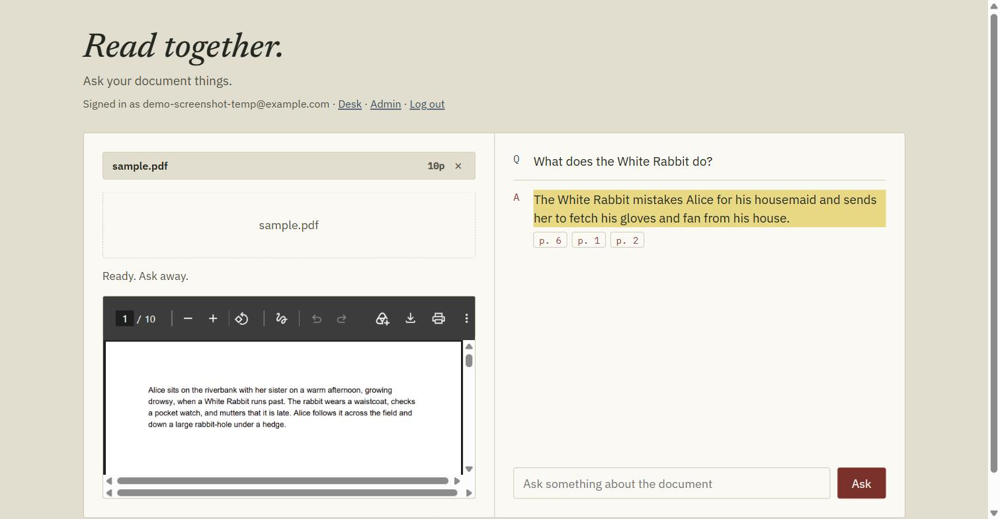
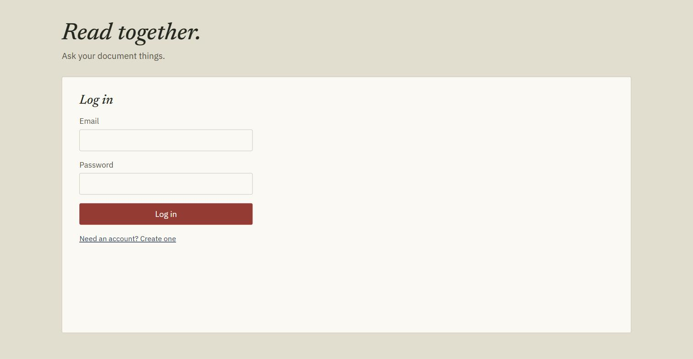
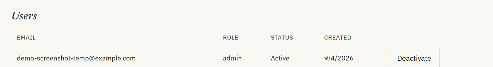

# Read together — Chat with PDF

[](https://github.com/cong-mai/chat-with-pdf/actions/workflows/ci.yml)
[](LICENSE)

A Retrieval-Augmented Generation (RAG) app that lets you upload a PDF and ask it questions, grounded in its actual content. A React frontend talks to a small Flask API that does the indexing and answering.



---

## Features

- Accounts with email/password login and admin/user roles
- Drop in a PDF and ask questions about it — each user only sees their own documents
- Answers are grounded in the document — no hallucination, with page-numbered source citations
- Powered by `gpt-4o-mini` for responses and `all-MiniLM-L6-v2` for embeddings
- Vector store persists between sessions (ChromaDB)
- PDF preview rendered inline
- Admin panel to deactivate/reactivate accounts

| | |
|---|---|
|  |  |

---

## Tech Stack

| Layer | Tool |
|---|---|
| Frontend | React (Vite) |
| API | Flask |
| Auth | JWT (`PyJWT`) + hashed passwords (`werkzeug.security`) |
| Accounts DB | MongoDB (`pymongo`) |
| LLM | OpenAI `gpt-4o-mini` |
| Embeddings | HuggingFace `all-MiniLM-L6-v2` |
| Vector DB | ChromaDB (local) |
| PDF Loader | PyMuPDF via LangChain |
| Orchestration | LangChain |
| Tests | pytest + mongomock (backend), Vitest + Testing Library (frontend) |
| CI | GitHub Actions (lint + test + build, backend and frontend) |
| Deployment | Docker Compose (local) / Railway (one container per service) |

---

## Architecture

```
Browser
  │
  ▼
nginx (frontend container)
  ├── static React build  (everything except /api/*)
  └── reverse-proxies /api/* ──────────────┐
                                            ▼
                                     Flask API (backend container)
                                       ├── MongoDB        — users, document metadata
                                       ├── ChromaDB        — per-document vector store (local disk)
                                       ├── HuggingFace embeddings (all-MiniLM-L6-v2, baked into the image)
                                       └── OpenAI gpt-4o-mini — answer generation
```

In production (Railway) the frontend and backend are two separate services, each built from its own self-contained Dockerfile; nginx talks to the backend over Railway's private network. See [`docs/Task.md`](docs/Task.md) for the detailed history of getting that deployment right (DNS caching, upload limits, timeouts, etc.).

---

## Project Structure

```
.
├── backend/
│   ├── app/                  # Flask API package
│   │   ├── __init__.py       # create_app() + package exports; gunicorn targets backend.app:app
│   │   ├── config.py         # env vars, constants, regexes
│   │   ├── extensions.py     # Mongo, OpenAI, and embedding clients (built once at import time)
│   │   ├── security.py       # JWT issuing + require_auth / require_admin decorators
│   │   ├── rate_limit.py     # per-key cooldown limiter (see Known Limitations)
│   │   ├── rag.py            # chunking, hashing, and the Chroma vector store
│   │   └── routes/           # one blueprint per resource: health, auth, documents, chat, admin
│   ├── tests/                 # pytest suite (mongomock + a fake embedder — no network calls)
│   ├── eval/                  # standalone retrieval-quality eval (not part of CI)
│   ├── create_admin.py        # CLI: create or promote an account to admin
│   ├── requirements.txt       # pinned runtime dependencies
│   └── requirements-dev.txt   # + pytest, mongomock, ruff
├── frontend/                  # React (Vite) UI
│   ├── src/
│   │   ├── components/        # AuthPanel, DocumentPanel, NotesPanel, AdminPanel
│   │   └── api.js             # fetch wrapper for the backend API
│   └── nginx.conf.template    # reverse proxy config used in the frontend's production image
├── docker-compose.yml         # mongo + backend + frontend, for local end-to-end runs
├── docs/Task.md               # planning/decisions log (deployment debugging, phased hardening)
├── .env                       # your API keys/secrets (not committed)
├── uploads/                   # uploaded PDFs (not committed)
└── data/                      # ChromaDB vector store (not committed)
```

---

## Prerequisites

- Python 3.11+
- Node.js 20+
- An [OpenAI API key](https://platform.openai.com/account/api-keys)
- A MongoDB connection string (e.g. a free [MongoDB Atlas](https://www.mongodb.com/cloud/atlas/register) cluster, or the `mongo` service in `docker-compose.yml`)

---

## Configuration

Copy `.env.example` to `.env` in the project root and fill in your own secrets:

```env
OPENAI_API_KEY=sk-...your-key-here...
MONGODB_URI=mongodb+srv://...your-connection-string...

# Required — generate with: python -c "import secrets; print(secrets.token_hex(32))"
JWT_SECRET=...a-long-random-string...

# Optional (defaults shown)
MONGODB_DB_NAME=reading_room
JWT_EXPIRES_HOURS=24
MAX_FILE_SIZE_MB=20
MIN_SECONDS_BETWEEN_CHATS=2
MIN_SECONDS_BETWEEN_AUTH_REQUESTS=2
FLASK_DEBUG=false
```

> **Never commit your `.env` file.** It is already listed in `.gitignore` — only `.env.example` is tracked.

---

## Quickstart — local dev (no Docker)

```bash
# 1. Clone the repo
git clone https://github.com/cong-mai/chat-with-pdf.git
cd chat-with-pdf

# 2. Backend: create a virtual environment and install Python deps
python -m venv .venv
source .venv/bin/activate        # macOS / Linux
.venv\Scripts\activate           # Windows
pip install -r backend/requirements-dev.txt

# 3. Frontend: install Node deps
cd frontend && npm install && cd ..
```

Create your admin account (after configuring `.env` — see above):

```bash
python backend/create_admin.py you@example.com yourpassword
```

Anyone else can sign up for a regular account from the app itself — `/api/auth/register` always creates the `user` role. Run `create_admin.py` again with a different email any time to add another admin, or with an existing email to promote/reset it.

Run the backend and frontend in two terminals:

```bash
# Terminal 1 — API (http://localhost:5000)
cd backend && flask --app app run --port 5000

# Terminal 2 — frontend dev server (http://localhost:5173)
cd frontend && npm run dev
```

Open `http://localhost:5173`. The dev server proxies `/api/*` requests to the Flask backend, so both run on the same origin from the browser's perspective — no CORS setup needed in development.

1. Log in with the admin account you created, or register a new account
2. Drop a PDF into the document pane, or choose a file
3. Once it says "Ready. Ask away.", type a question in the notes pane

---

## Quickstart — Docker Compose

Runs MongoDB, the Flask API, and an nginx-served production build of the frontend together:

```bash
docker compose up --build
```

Then open `http://localhost:8080`. The backend's health check (`/api/health`) gates the frontend's startup, and `uploads/`, `data/`, and Mongo's own storage persist in named volumes between runs.

---

## Testing & linting

```bash
# Backend
pip install -r backend/requirements-dev.txt
pytest backend/tests -q      # 51 tests — mongomock + a fake embedder, no network calls
ruff check backend           # lint

# Frontend
cd frontend
npm test                     # Vitest + Testing Library
npm run lint                 # ESLint
npm run build                # production build
```

All four run in CI on every push/PR (see `.github/workflows/ci.yml`).

---

## API overview

All routes are prefixed with `/api` and (except `/api/health` and `/api/auth/*`) require `Authorization: Bearer <token>`.

| Method | Path | Description |
|---|---|---|
| GET | `/health` | Liveness check — pings MongoDB |
| POST | `/auth/register` | Create a `user`-role account |
| POST | `/auth/login` | Exchange credentials for a JWT |
| GET | `/auth/me` | Current user from the token |
| POST | `/documents` | Upload a PDF (multipart), chunk it, and index it |
| GET | `/documents` | List the caller's own documents |
| GET | `/documents/<file_id>/file` | Stream the original PDF back |
| DELETE | `/documents/<file_id>` | Delete a document and its vectors |
| POST | `/chat` | Ask a question about one of the caller's documents |
| GET | `/admin/users` *(admin)* | List all accounts |
| PATCH | `/admin/users/<user_id>` *(admin)* | Activate/deactivate an account |

---

## Known limitations

- **Rate limiting is per-process, in-memory** (`backend/app/rate_limit.py`) — correct for the current single-worker Gunicorn deployment, but it resets on every restart and wouldn't be correctly enforced if this ran with multiple workers or replicas. Scaling horizontally would mean moving those cooldown buckets to Redis (or similar) so every process shares one view of "when did this key last make a request."
- For a production build, run `npm run build` in `frontend/` and serve the resulting `frontend/dist/` alongside the API — see `frontend/Dockerfile` / `frontend/nginx.conf.template` for how this repo does that.

---

## License

[MIT](LICENSE)
